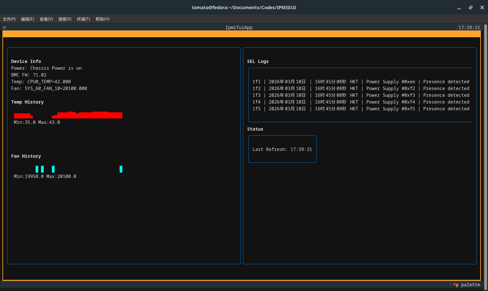

# IPMITool TUI



一个终端 IPMI 工具，支持：

- 带内 (`inband`) / 带外 (`oob`) 模式支持（需通过配置文件配置）
- UI 启动动画与丝滑的异步非阻塞刷新
- 类似 btop++ 的可视化仪表盘展示：
  - 精细折线图（块状字符）直观呈现风扇转速和温度历史变化
  - IPMI 电源状态、BMC 信息、实时温度与风扇读数
  - SEL 日志显示与状态监控
- 刷新间隔可调

## 依赖

- Python 3.8+
- `ipmitool`（必须安装到 PATH）
- `textual`（现代 TUI 框架）

Debian/Ubuntu:

```bash
sudo apt-get install -y ipmitool
pip3 install textual
```

RHEL/CentOS/Fedora:

```bash
sudo dnf install -y ipmitool
pip3 install textual
```

## 运行

```bash
python3 ipmi_tui.py
```

## 配置文件

- 默认路径：`~/.config/ipmi_tui/config.json`
- 手动填写 `host`, `username`, `password`, `mode` 等配置。

形如：
```json
{
  "mode": "oob",
  "host": "192.168.1.100",
  "username": "admin",
  "password": "password",
  "refresh_interval": 3,
  "remember_cred": true
}
```

注意：开启“记住凭据”且手动配置时，密码明文保存在本地配置文件中，请仅在受信任环境使用。
