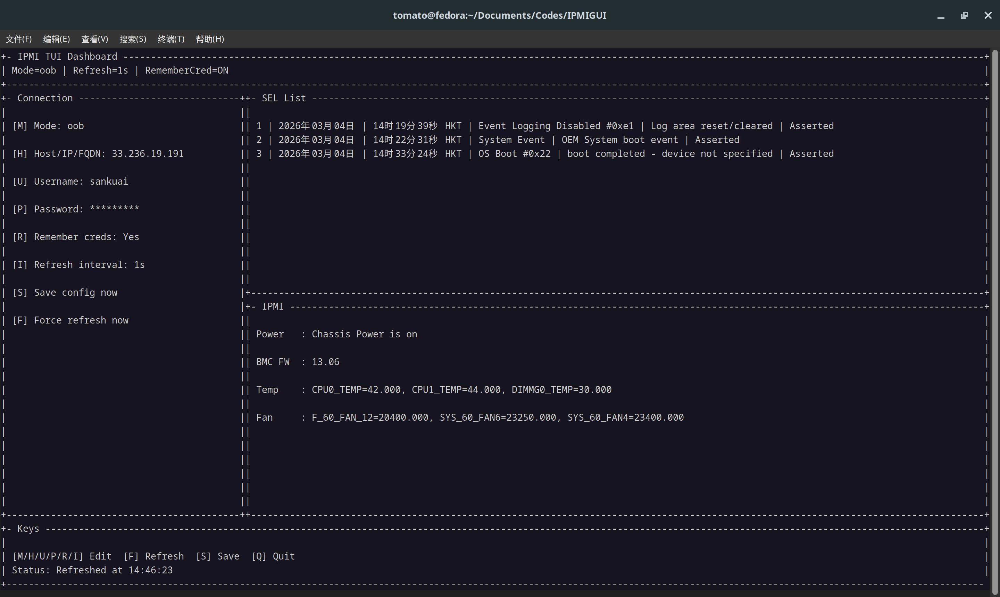

# IPMITool TUI



一个终端 IPMI 工具，支持：

- 带内 (`inband`) / 带外 (`oob`) 模式切换
- 带外模式输入 `IP/FQDN + 用户名 + 密码`
- 选择是否记住用户名密码（保存到本地配置文件）
- 类似 btop 的分区式仪表盘展示：
  - 当前机器负载/内存/运行时长
  - IPMI 电源状态、BMC 信息、温度、风扇
- 刷新间隔可调（1-300 秒）

## 依赖

- Python 3.8+
- `ipmitool`（必须安装到 PATH）

Debian/Ubuntu:

```bash
sudo apt-get install -y ipmitool
```

RHEL/CentOS/Fedora:

```bash
sudo dnf install -y ipmitool
```

## 运行

```bash
python3 ipmi_tui.py
```

## 按键

- `M`: 切换模式（带内/带外）
- `H`: 设置 IP/FQDN
- `U`: 设置用户名
- `P`: 设置密码
- `R`: 切换是否记住凭据
- `I`: 设置刷新间隔（秒）
- `F`: 立即刷新
- `S`: 保存配置
- `Q`: 退出

## 配置文件

- 默认路径：`~/.config/ipmi_tui/config.json`
- 文件权限会设置为 `600`

注意：开启“记住凭据”后，密码会明文保存在本地配置文件中，请仅在受信任环境使用。
